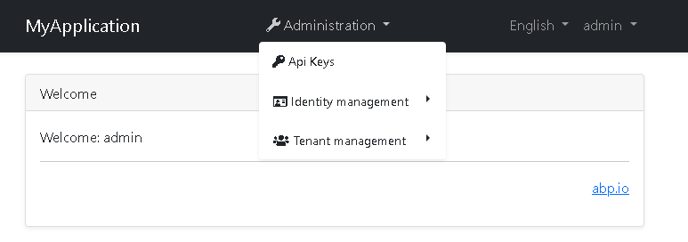
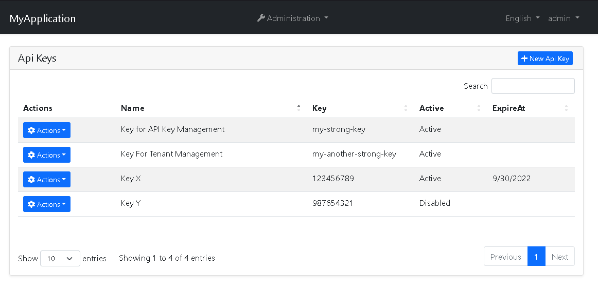
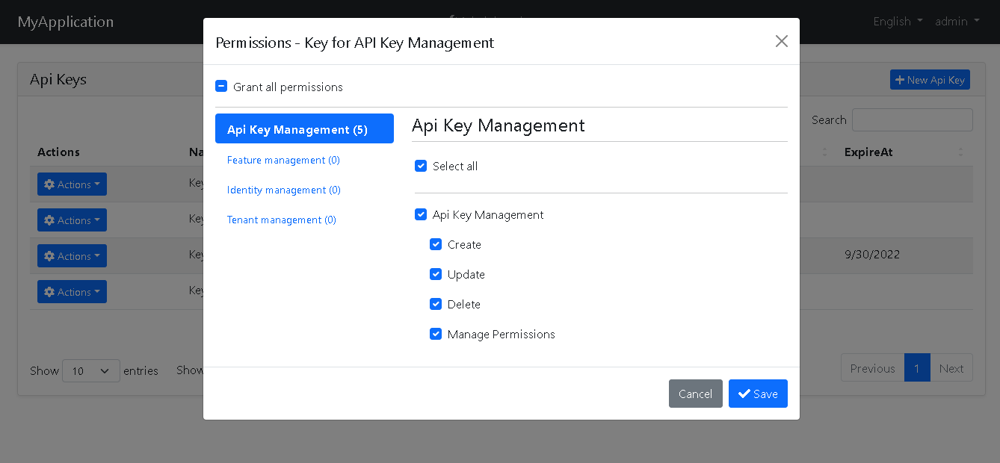

# API Key Authorization Module for [ABP](https://github.com/abpframework/abp) Based Applications

This module provides adding and managing dynamic API Keys with permissions for your application.







> The API Key Authorization Management UI is currently available for only MVC applications.

> The API Key Authorization is currently available for only Entity Framework.

## What is API Key?

An application programming interface key (API key) is a unique identifier used to authenticate a user, developer, or calling program to an API. However, they are typically used to authenticate a project with the API rather than a human user. Different platforms may implement and use API keys in different ways. [(ref: wikipedia)](https://en.wikipedia.org/wiki/Application_programming_interface_key)

## Pre Requirements

-   API Keys Module uses [distrubuted cache](https://docs.abp.io/en/abp/latest/Caching) for responding faster.

## How to Install

This module's projects are not published yet as NuGet packages, so for now, you need to download the module via GitHub and add references each project to related application project.

1. Download the module source code
2. Add project references one by one as following:
    - `*.Domain.Shared` -> `Cotur.Abp.ApiKeyAuthorization.Domain.Shared`
    - `*.Domain` -> `Cotur.Abp.ApiKeyAuthorization.Domain`
3. Add module types as `DependsOn` attribute parameter.
    - Example for Domain module:
    ```csharp
    [DependsOn(
        //..
        typeof(ApiKeyAuthorizationDomainModule)
    )]
    ```
4. Add configuration for your `*.HttpApi.Host` or `*.Web` project.

    ```csharp
    public async override Task OnApplicationInitializationAsync(ApplicationInitializationContext context)
    {
        var app = context.GetApplicationBuilder();
        var env = context.GetEnvironment();

        // ..
        app.UseAuthentication();

        app.UseApiKeyAuthorization();

        app.UseAuthorization();

        //..

    }

    ```

5. Configure your `DbContext`

    ```csharp
    protected override void OnModelCreating(ModelBuilder modelBuilder)
    {
        base.OnModelCreating(modelBuilder);

        //..
        modelBuilder.ConfigureApiKeyAuthorization();
    }
    ```

6. Add migrations & update your database
7. [Optional] Set your api key name at your module class.

```csharp
public override void ConfigureServices(ServiceConfigurationContext context)
{
    Configure<ApiKeyOptions>(o =>
    {
        o.ApiKeyName = "my-key-name";
    });
}
```

or

`appsettings.json`

```json
{
    "apiKeys": {
        "apiKeyName": "my-key-name"
    }
}
```
